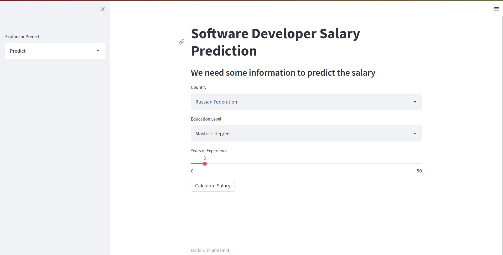
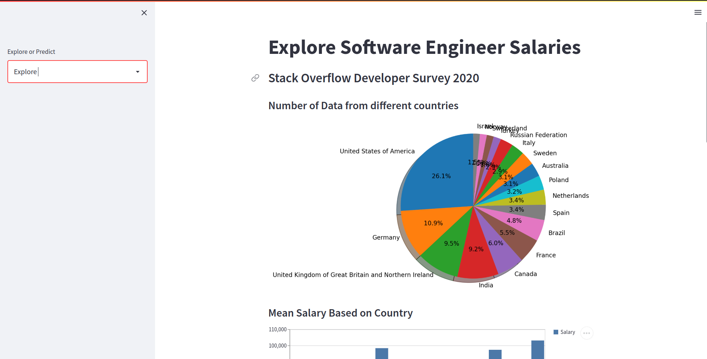
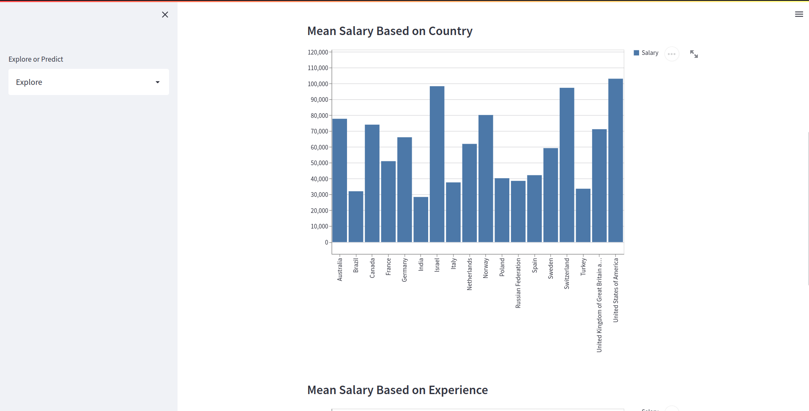
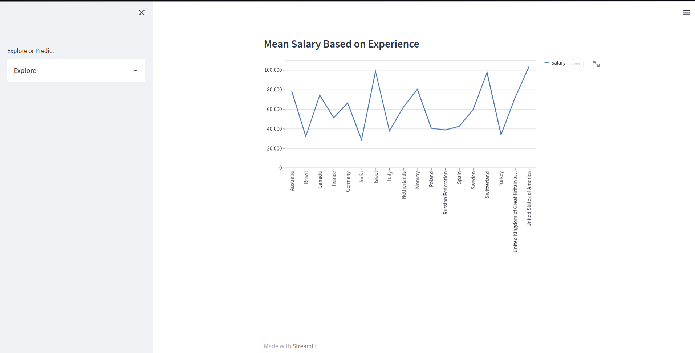

# SDE Predictor Web App

This is a Streamlit web application built with Python that predicts the salaries of software developers in different countries. The application utilizes machine learning algorithms to estimate the potential earnings based on various factors such as experience, education, programming languages, and location.

Link to Web App : [https://sde-salary-prediction.onrender.com](https://sde-salary-prediction.onrender.com)

Dataset : StackOverflow Developer Survey 2021 Dataset.

**Languages Used :**

 

**Libraries Used :** 

- Numpy 
- Pandas
- Matplotlib
- Scikit-Learn 
- Streamlit

The Web App was made with [Streamlit](https://streamlit.io/) and Deployed on [Render](https://render.com/)

**For Users :**

- Select Explore/Predict page
- On Predict page, you must select Country, Education Level and Years of Experience.
- On Explore 

### Predict Page :

---

### Explore Page :

 

 

## Installation

1. Clone the repository:
`https://github.com/Keraskp/Software-Developer-Salary-Prediction.git`

2. Navigate to the project directory:
`cd Software-Developer-Salary-Prediction/`

3. Create a virtual environment (optional but recommended):
`python3 -m venv venv`

4. Activate the virtual environment:
`source venv/bin/activate`

5. Install the required dependencies:
`pip install -r requirements.txt`

To run the application, execute the following command:
`streamlit run app.py`

This will start the web app locally, and you can access it by visiting `http://localhost:8501` in your web browser.

## Input Parameters

The Salary Predictor Web App requires the following input parameters to estimate the salary:

- Experience (in years): The number of years of professional experience the software developer has.
- Education Level: The highest level of education attained by the software developer.
- Country: The country in which the developer is seeking employment.

## Model

The salary prediction model used in this application is trained on a dataset of software developer salaries from various countries. It employs machine learning techniques, such as regression algorithms, to learn patterns and relationships between the input features and the corresponding salaries.

## Data Sources

The salary data used to train the prediction model is derived from a combination of publicly available surveys, job portals, and other relevant sources. The data is preprocessed and anonymized to ensure privacy and data protection.

## Contributions

Contributions to this project are welcome. If you encounter any issues or have suggestions for improvement, please feel free to submit a pull request or open an issue in the project repository.

## License

This project is licensed under the [MIT License](LICENSE).

## Disclaimer

The salary predictions provided by this web application are estimates based on historical data. Actual salaries may vary depending on a variety of factors not accounted for in the model. The application is intended for informational purposes only, and the developers are not responsible for any decisions made based on the predicted salary values.

---

